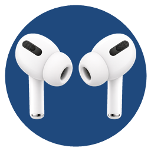

<div align="center">
  
  <h1>PodRelay</h1>
  <p><a href="https://github.com/quqinyuni/PodRelay/actions/workflows/ci.yml"></a> <a href="https://github.com/quqinyuni/PodRelay/releases/latest"></a></p>
  <p>让已经配对的 AirPods 在 Windows 上更像“生态设备”一样接力。</p>
  <p>自动连接、入耳播放控制、手柄唤醒，以及适合客厅大屏幕的连接弹窗。</p>
</div>

> [!IMPORTANT]
> PodRelay 是社区开发的非官方工具，与 Apple Inc. 没有关联。它不会模拟 Apple ID、iCloud 或 MagicPairing，也不会修改或移除系统蓝牙配对。

## 它解决什么问题

Windows 已经记住 AirPods 后，切换回来通常仍要打开蓝牙设置手动连接。以下场景尤其麻烦：

- 办公电脑没有其他可用输出设备，AirPods 刚刚还连接着手机；
- 客厅电脑通过远程方式开机，只拿着手柄使用 Steam 大屏幕模式；
- 戴上或取下耳机时，希望视频像在 Apple 设备上一样继续或暂停。

PodRelay 将这些操作统一为幂等的“确保 AirPods 已连接”：重复触发不会断开耳机，只会检查并修复连接、立体声音频端点和默认输出。

## 主要功能

- 枚举 Windows 已配对的蓝牙音频设备，并按蓝牙地址和设备容器稳定绑定目标耳机；
- 自动从手机等设备接回 AirPods，并验证蓝牙、Stereo 端点和 Windows 默认输出全部就绪；
- 登录、解锁、目标出现或没有可用音频输出时自动接力；
- 取下正在佩戴的耳机自动暂停，重新戴上后恢复由 PodRelay 暂停的媒体；
- 用户取消或准备切到其他设备后进入冷却，不会立即把耳机抢回来；
- 绑定手柄后，在该手柄接入 Windows 时自动确保 AirPods 已连接；
- 支持全局快捷键，默认 `Ctrl + Alt + A`，可通过 Steam Input 映射为手柄组合键；
- 原创大屏幕弹窗，显示附近、连接中、成功和可重试的失败状态；
- 任务栏和通知区域图标显示 AirPods 及当前连接状态；
- 本地 JSONL 诊断日志和一键导出，不包含遥测或云端服务。

## 下载

前往 [Releases](https://github.com/quqinyuni/PodRelay/releases/latest) 下载最新的 `PodRelay-win-x64.zip`。

1. 解压 ZIP 到任意普通文件夹；
2. 运行 `Start-PodRelay.cmd`；如果已经安装运行环境，也可以直接运行 `PodRelay.exe`；
3. 如果 Windows SmartScreen 提示未知发布者，请确认文件来自本仓库后选择继续运行。

发布包保持小体积，不内置 .NET。推荐运行 `Start-PodRelay.cmd`：它会先检测 [.NET 8 Desktop Runtime](https://dotnet.microsoft.com/download/dotnet/8.0)，缺失时明确征求同意，仅从 Microsoft 官方地址下载，并验证安装程序的 Microsoft Authenticode 签名后请求安装。它不会未经确认静默安装。程序本身尚未使用受公开信任的 Authenticode 证书签名。

## 首次设置

1. 先在 Windows **设置 → 蓝牙和设备** 中完成一次 AirPods 配对；
2. 启动 PodRelay，在设备列表中选择目标耳机；
3. 根据需要开启自动接力、入耳检测、弹窗和手柄接力；
4. 点击 **保存**；
5. 点击 **连接 AirPods**，确认状态变成“已连接且声音已切换”；
6. 关闭设置窗口即可，PodRelay 会继续在通知区域运行。

双击托盘图标或按下全局快捷键会执行“确保已连接”。托盘菜单中的“释放给其他设备”不会强制破坏 Windows 配对，而是暂停自动抢回，让你从 iPhone、iPad 或其他设备手动连接。

## Steam 大屏幕与手柄

最简单的方式是在 Steam Input 中把 `Guide/Xbox/PS + Y` 映射为 `Ctrl + Alt + A`。PodRelay 也可以绑定一个 Windows 游戏控制器：当该手柄上线时触发接力，但不会读取或占用任何按键。

详细步骤见 [Steam Input 设置说明](docs/steam-input.md)。PodRelay 不注入游戏进程，也不会为了覆盖独占全屏游戏而引入反作弊风险。

## 入耳播放控制

PodRelay 读取 AirPods 广播中的两只耳机入耳状态，并向 Windows 发送独立的 `PAUSE` / `PLAY` 媒体命令：

- 已佩戴数量减少时暂停；
- 只有 PodRelay 成功执行过暂停，重新戴上时才允许恢复；
- 原本就暂停的视频不会因取下耳机而被切换成播放；
- 优先用 Windows 蓝牙产品 ID 绑定到具体 AirPods 版本，避免附近另一版本的 Pro 2 广播误触发；
- 锁屏、AirPods 未连接到这台 Windows 或功能关闭时不会控制媒体；
- 180ms 本地防抖与短暂戴回稳定期用于过滤传感器回跳。

最终响应还会受到 AirPods 蓝牙广播间隔影响。该功能已在 AirPods Pro 2 上完成真实播放测试。

## 系统要求

- Windows 10 版本 2004（Build 19041）或更新版本，或 Windows 11；
- 64 位系统；
- Windows 支持的蓝牙适配器；
- AirPods 已经在 Windows 中完成配对；
- .NET 8 Desktop Runtime；使用发布包内的启动器时会检测并在征得同意后协助安装。

目前主要使用 AirPods Pro 2 验证。其他 AirPods 型号可能可以工作，但尚未完成同等程度的硬件测试。

## 隐私与安全

- 默认离线工作，无账户、遥测和云端依赖；
- 设置和日志只保存在 `%LOCALAPPDATA%\PodRelay`；
- 不安装驱动或 Windows 服务；
- 不删除蓝牙配对，不重启蓝牙服务；
- 不模拟 Apple ID、iCloud 或 MagicPairing；
- 不向 Steam 或游戏进程注入代码。

导出的诊断 ZIP 会包含本机保存的蓝牙地址和本地日志，公开分享前请先检查并脱敏。

## 已知限制

- Apple 没有公开 AirPods 广播格式，佩戴和盒盖状态来自公开研究及真实设备验证，未来固件可能改变；
- 广播本身没有可稳定映射到 Windows 配对记录的公开身份；PodRelay 会区分具体产品版本，但附近同一版本的 AirPods 仍可能触发一次检查；
- Windows 没有稳定公开的 A2DP 主动连接 API，当前无驱动方案使用了隔离封装的 Windows 系统契约，并在每次调用后验证最终结果；
- 独占全屏游戏可能覆盖普通桌面弹窗，此时应使用快捷键或手柄映射；
- 暂不显示电量，也没有启用手柄震动；
- 未签名程序可能受到 SmartScreen 或企业应用控制策略限制。

完整列表见 [已知限制](docs/known-limitations.md)，常见问题见 [故障排查](docs/troubleshooting.md)。

## 签名与构建来源

GitHub Actions 会在 Windows 环境重新构建和测试公开源码，并为应用发布包生成 GitHub 构建来源证明。Release 同时公布 SHA-256，用于确认下载文件未被替换。

这不等同于 Windows Authenticode 身份签名。项目已经提供严格的 [签名流程](docs/signing.md)，但必须由原作者持有的可信代码签名证书执行；仓库不会生成误导用户的自签名根证书，也不会保存私钥。

## 从源码构建

需要 .NET 8 SDK：

```powershell
./build.cmd
./test.cmd
./publish.cmd
```

也可以直接运行诊断工具：

```powershell
dotnet run --project ./src/PodRelay.Diagnostics -- list-bluetooth
dotnet run --project ./src/PodRelay.Diagnostics -- default-audio
dotnet run --project ./src/PodRelay.Diagnostics -- status --address 00:11:22:33:44:55
dotnet run --project ./src/PodRelay.Diagnostics -- watch-airpods --seconds 20
```

项目使用 C#、.NET 8 和 WPF。架构说明见 [docs/architecture.md](docs/architecture.md)，真实与自动化验证范围见 [docs/verification.md](docs/verification.md)。

## 第三方与商标

第三方代码声明见 [THIRD-PARTY-NOTICES.md](THIRD-PARTY-NOTICES.md)。界面中的耳机插图和应用图标为项目生成的原创素材，不包含 Apple 官方产品图片。

Apple、AirPods、AirPods Pro、iPhone、iPad 和 Apple TV 是 Apple Inc. 的商标。Steam 是 Valve Corporation 的商标。所有商标仅用于描述兼容性，其权利归各自所有者。

## 许可证与原作者

PodRelay 由 [quqinyuni](https://github.com/quqinyuni) 发起并作为原作者，以 [MIT License](LICENSE) 开源。

你可以使用、复制、fork、修改和再发布本项目，也可以用于商业用途；按照 MIT License，任何副本或重要部分都必须保留原作者版权声明和许可文本。
